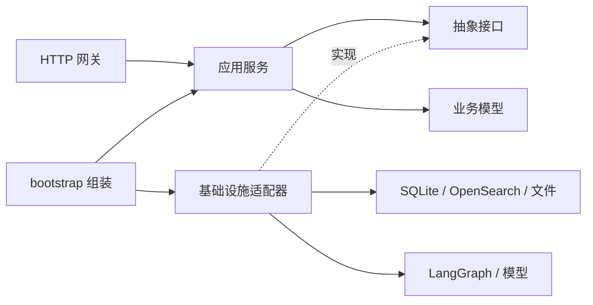

# 工程分层与维护约定

当前系统采用单进程内的分层结构。HTTP 网关处理接入协议，应用服务编排业务用例，业务模型定义共享契约，基础设施实现数据库、搜索引擎和模型适配。

## 目录和职责

```text
back/
  domain/                    业务模型、会话契约、业务错误
  application/
    ports.py                 SessionRepository 抽象类和各依赖的 Protocol
    chat.py                  聊天、上下文装配、缓存策略与会话保存
    images.py                图片聊天用例
    tenants.py               企业资料维护用例
    knowledge.py             知识源上传、重索、删除用例
  interfaces/http/
    app.py                   ASGI 组装、生命周期、错误映射
    auth.py                  租户和管理员认证
    chat.py                  聊天 HTTP 和 NDJSON 编码
    admin.py                 管理接口
    public.py                公开资料接口
    schemas.py               HTTP 请求与响应模型
  infrastructure/
    persistence/             SQLite 租户、知识源、缓存和会话仓储
    search/                  OpenSearch 适配器
    agent.py                 LangGraph 执行与事件转换
    files.py                 知识源文件读写与路径边界
    services.py              默认依赖适配器
  bootstrap.py               依赖组装入口
  agent/
    analysis/                模型分析、确定性规则、结构化解码、上下文降级
    workflow/graph.py         当前流程的节点注册与连线
    workflow/*_nodes.py       分析、检索、回答节点
    workflow/legacy.py        旧节点兼容验证，当前主图不注册
    response/                证据约束回答
  knowledge/
    ingestion/               文档加载与切分
    images/                  OCR 和图片语义处理
    indexing/                单源索引与显式重建流程
    retrieval/               混合召回、精排与缓存策略
  tenant/                    租户初始化及旧调用兼容入口
  core/                      模型配置与稳定路径

front/src/
  api/                       HTTP 客户端
  types/                     接口类型
  hooks/                     会话切换、主题、资料和知识源状态
  components/chat/           消息、输入框、欢迎页、图片预览
  components/feature-boundary.tsx  功能级渲染错误边界
  lib/chat-adapter.ts         assistant-ui 与真实聊天接口的适配
  lib/chat-storage.ts         浏览器会话列表和展示历史
```

## 依赖方向



- `application` 和 `domain` 不导入 HTTP、SQLite 驱动或具体基础设施。自动化测试检查这一边界。
- 通过构造函数向服务提供 `ChatEngine`、`SessionRepository`、`AnswerCache`、`TenantRepository`、`KnowledgeRepository`、`SourceFiles`、`KnowledgeIndexer` 和 `ImageInterpreter`。
- 替换数据库或模型执行方式时，实现对应接口，在 `bootstrap.py` 中组装即可。普通策略函数无需强行改成类。
- 认证由网关完成。新增命令行、消息队列等接入渠道时，需要为该渠道提供授权边界。
- SQL 集中在持久化目录；缓存阈值、问题归一化、证据判断等属于业务策略，不写进 SQL 仓储。

## 会话持久化

后端上下文写入独立的 `data/sessions.db`，可通过 `SESSION_DB_PATH` 指定路径。默认保存最近 40 条消息和当前问题状态，不持久化检索候选、向量或大型文档对象。SQLite 中采用 JSON 格式，不使用 pickle。

会话以 `(tenant_id, session_id)` 隔离。读取同时取得版本号，保存时检查该版本：并发请求不能静默覆盖先完成的回复，冲突请求得到 409；流式请求在最终事件阶段报告错误。

新建服务实例或重启后端可以恢复已持久化上下文。旧进程中尚未落盘的内存会话无法自动恢复。浏览器本地历史仍负责展示，不等同于后端上下文存储。

聊天请求可附带 `turn_id`；旧客户端不传时仍按新增一轮处理。相同 ID 的重试会替换该轮，显式 `regenerate` 会从该轮之前的历史和问题状态重新生成，成功落盘前保留原回答。图片重生复用已保存的识别文本。前端持久化消息 ID；升级前没有对应 ID 的历史通过 `previous_answer_hash` 唯一匹配旧答案，无法唯一定位或超出后端历史保留范围时返回 409，避免错误截断会话。

`APP_TENANT_ID` 只限制租户范围。配置了 `TENANT_ACCESS_KEYS` 的受控租户仍需令牌；显式公开白名单和未配置凭据的原有公开客服模式保留。

创建租户使用数据库唯一约束执行原子创建，重复 ID 返回 409 并保留原资料和缓存；资料修改仍通过原有更新接口执行缓存失效。

知识源上传、重索和删除通过 `filelock` 对同一来源进行跨进程互斥。锁位于业务 SQLite 库旁的 `operation_locks/`，进程退出后操作系统释放持有的锁；同源并发操作返回 409，可完成后重试。索引删除响应中的冲突、超时或失败会中止文件和登记清理。

知识及企业资料变更期间持有租户缓存变更锁，清空缓存并递增 SQLite 中的缓存版本。该租户的其他知识变更暂时返回 409；聊天请求继续运行，但跳过缓存。回答开始时捕获版本，写入时在同一 SQLite 写事务中检查版本，防止在途旧回答重新进入缓存。版本表为新增表，原有知识、租户和会话数据无需重建。

上传在落盘、登记及内容去重前取得租户变更锁；因繁忙而被拒绝时不生成“处理中”记录，完成后可重试上传。企业资料快捷路由只匹配完整资料提问；平台名称不会覆盖已经整理的多轮上下文，结束确认只接受完整肯定句，含否定、疑问或其他诉求的消息继续进入分析流程。

## 故障处理边界

| 故障 | 当前处理 |
|---|---|
| 缓存查询或写入失败 | 聊天继续调用模型或返回已经生成的回答 |
| 模型执行失败 | 当前聊天返回 503，健康检查和企业资料接口继续工作 |
| 搜索初始化或模型预热失败 | 启动记录降级状态，其余接口继续启动 |
| 会话库不可用 | 当前聊天返回 503，避免伪装成已保存；企业资料接口不依赖会话库 |
| 单条会话数据损坏 | 该会话报错，其他会话仍可读取 |
| 删除知识源时搜索失败 | 不继续删除源文件和登记记录 |
| 删除知识源时文件清理失败 | 保留登记记录并返回错误，允许重试 |
| 图片认证失败 | 不调用 OCR 或视觉模型 |
| 管理后台组件渲染失败 | 功能错误边界提供重试与关闭，不卸载整个聊天页面 |

缓存失效是知识变更的正确性条件。资料或知识源变更时，不能把失效失败当成普通缓存查询失败忽略，否则可能继续提供旧答案。

上述隔离属于模块和请求级隔离。同一进程的崩溃、内存耗尽、整盘故障仍可能影响多个功能；SQLite、文件和 OpenSearch 之间也没有分布式事务。当前使用顺序操作、失败记录和重试保留恢复空间，未提供跨存储的全局原子提交。`/health` 中的降级信息反映启动检查，不是持续探测结果。

## 验证

默认回归只运行离线测试，使用临时业务库、会话库和上传目录，并阻止真实网络连接。

```powershell
.\.venv\Scripts\python.exe -m pytest -q
.\.venv\Scripts\python.exe -m pytest tests/test_engineering_boundaries.py -q
```

真实模型测试必须显式启用，模型配置来自当前环境。它们验证模型输出行为，耗时和稳定性取决于模型服务。

```powershell
.\.venv\Scripts\python.exe -m pytest --run-live-model -m live_model -q
```

手工上下文示例位于 `evaluation/manual/context_analysis.py`，不会在默认测试收集时调用模型。

新增行为时优先在服务上注入测试替身。涉及持久化和并发时使用临时 SQLite 验证实际行为；涉及流式输出时同时检查最终状态和错误事件。

## 兼容与后续维护

`back.api:app` 仍是 ASGI 入口；原有 HTTP 路径和请求响应结构保留。`back/tenant/models.py`、`back/tenant/store.py`、`back/knowledge/retrieval/opensearch.py` 和旧前端适配器名称保留薄兼容导出，新代码使用实际职责目录。

索引、OCR 和重排仍使用既有成熟组件。这次重构没有改变知识库数据、重新建立生产索引或启动数据迁移。当前本地模型配置统一为 `gpt-5.5`；向量模型的配置独立保留。
